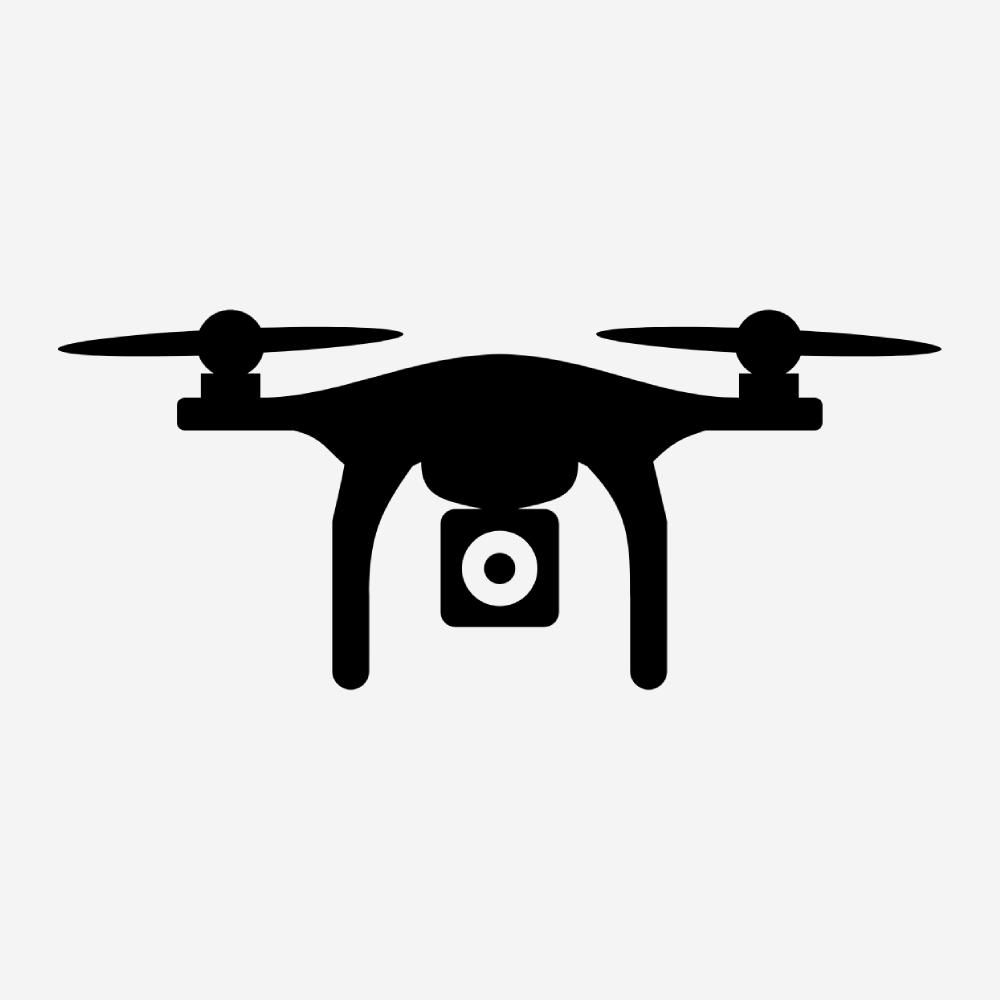

  
  

 

  

  <h3 align="center">Drone Directory</h3>
  
A platform for finding and sharing the perfect drone spots in the British isles.

  

# Deploy using Docker

1. Navigate to the cloned repo
2. Run `docker build -t droneDirectory .`
3. Run `docker run -d droneDirectory`

# Running locally (for development)

1. Install bun `npm install -g bun`
2. Navigate to the cloned repo and run `bun install`
3. Run `bun run dev` to start the development server.
